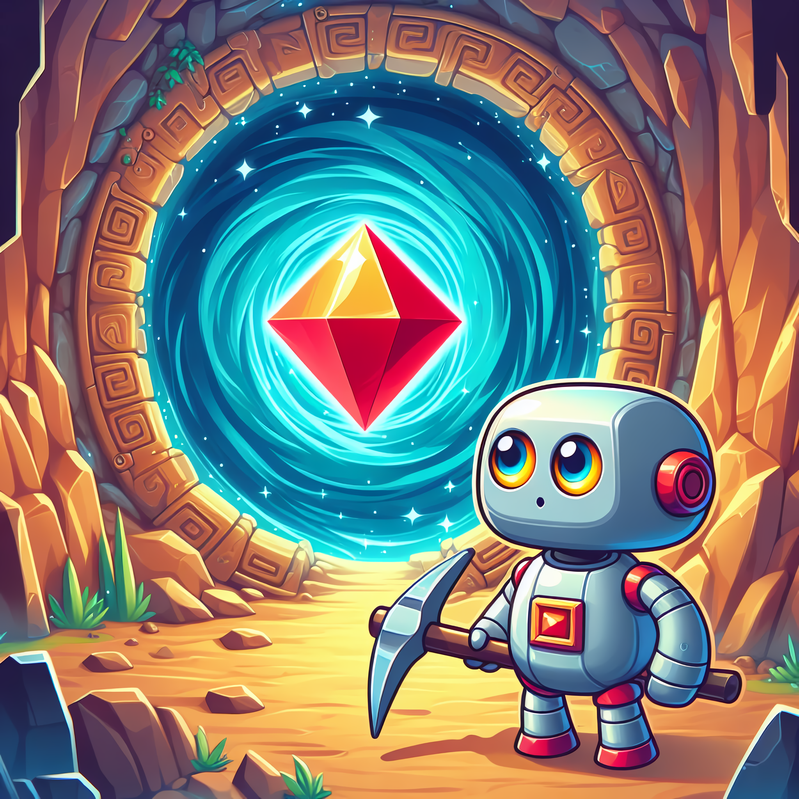

# Tubes1_pinjamdulu100v2

<a name="readme-top"></a>


<!-- PROJECT LOGO -->
<br />
<div align="center">
    
</div>

<h3 align="center">Etimo Diamond</h3>

  <p align="center">
    LETS FIND DIAMOND
    <br />
    <a href="https://github.com/GAIB21/tugas-besar-if2121-logika-komputasional-2023-retractall-tubes"><strong>Explore the docs »</strong></a>
    ·
    <a href="https://github.com/GAIB21/tugas-besar-if2121-logika-komputasional-2023-retractall-tubes/issues">Report Bug</a>
    <br/>
  </p>
</div>


<!-- TABLE OF CONTENTS -->
<details>
  <summary>Table of Contents</summary>
  <ol>
    <li>
      <a href="#about-the-project">About The Project</a>
    </li>
    <li>
      <a href="#getting-started">Getting Started</a>
      <ul>
        <li><a href="#prerequisites">Prerequisites</a></li>
        <li><a href="#HOW TO USE">HOW TO USE</a></li>
      </ul>
    </li>
    <li><a href="#usage">Usage</a></li>
    <li><a href="#Project-Status">Project Status</a></li>
    <li><a href="#Room-for-Improvement">Room for Improvement</a></li>
    <li><a href="#Acknowledgments">Acknowledgments</a></li>
    <li><a href="#Features">Features</a></li>
  </ol>
</details>


## About The Project

Diamonds merupakan suatu programming challenge yang mempertandingkan bot yang
anda buat dengan bot dari para pemain lainnya. Setiap pemain akan memiliki sebuah bot
dimana tujuan dari bot ini adalah mengumpulkan diamond sebanyak-banyaknya. Cara
mengumpulkan diamond tersebut tidak akan sesederhana itu, tentunya akan terdapat
berbagai rintangan yang akan membuat permainan ini menjadi lebih seru dan kompleks.
Untuk memenangkan pertandingan, setiap pemain harus mengimplementasikan strategi
tertentu pada masing-masing bot-nya


<br/>


<!-- GETTING STARTED -->
## Getting Started

### Prerequisites

  
```sh
  Docker
  Python 
  Node.js
```  


### HOW TO USE

1. Set Up Engine
   

GET TO THIS REPO AND FOLLOW THE INSTRUCTION

```sh
   git clone https://github.com/haziqam/tubes1-IF2211-game-engine
``` 

   
2. CLONE THIS REPO

   ```
   git clone https://github.com/mzaki9/Tubes1_pinjamdulu100v2
   ```
2. GO TO SRC
   
```sh
   cd src/
```   

3. Start the game
```sh
   ./run-bots.bat
```  


<br/>


<p align="right">(<a href="#readme-top">back to top</a>)</p>


<!-- PROJECT STATUS -->
## Project Status
Project status: complete 
<br/>
<p align="right">(<a href="#readme-top">back to top</a>)</p>


<!-- ACKNOWLEDGMENTS -->
## Acknowledgments


* [Hugo Sabam Augusto](https://github.com/miannetopokki)

* [Muhammad Zaki](https://github.com/mzaki9)

* [Andi Marihot S](https://github.com/melonseed9)


<p align="right">(<a href="#readme-top">back to top</a>)</p>


<!-- MARKDOWN LINKS & IMAGES -->
<!-- https://www.markdownguide.org/basic-syntax/#reference-style-links -->
[github-url]: https://github.com/mzaki9/Tubes1_pinjamdulu100v2